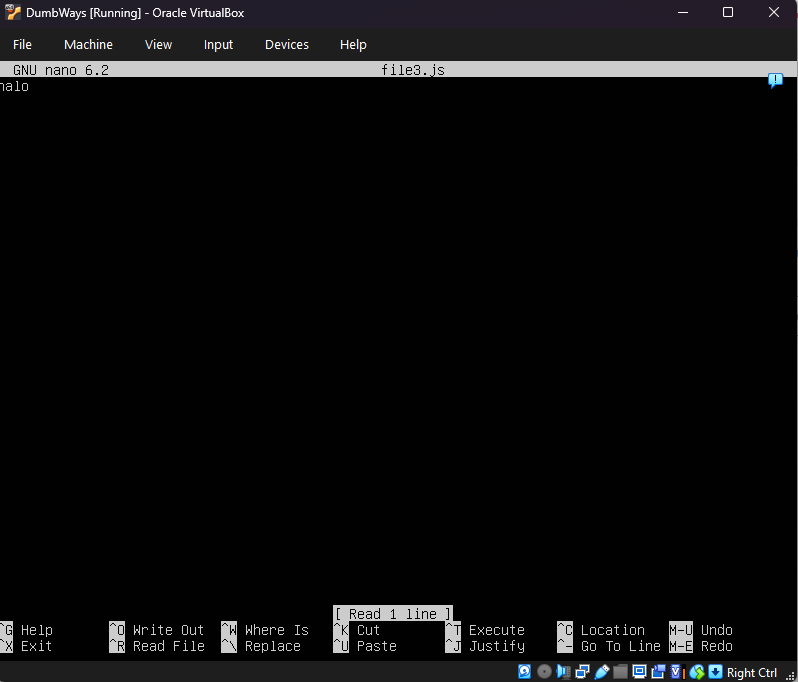
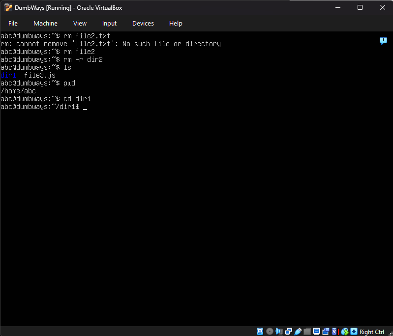
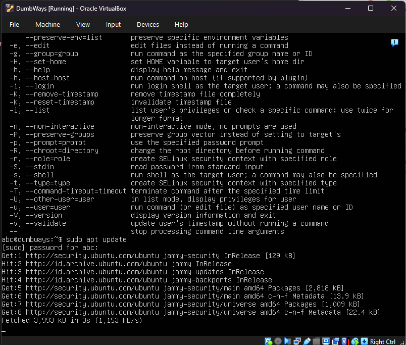
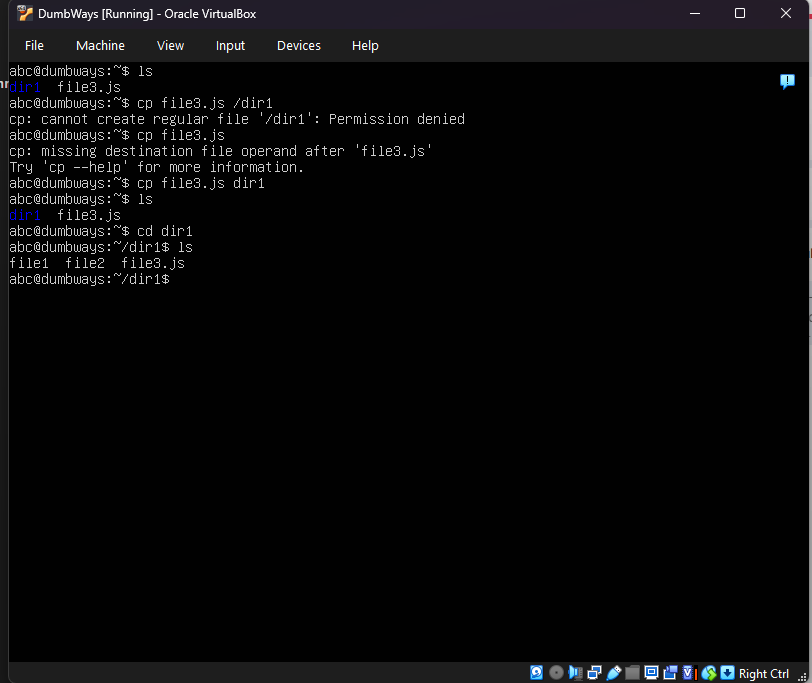
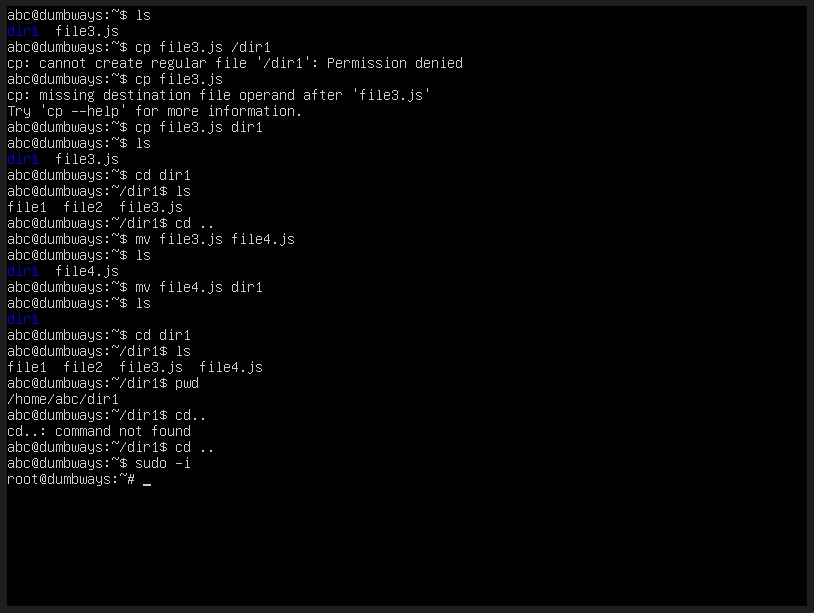
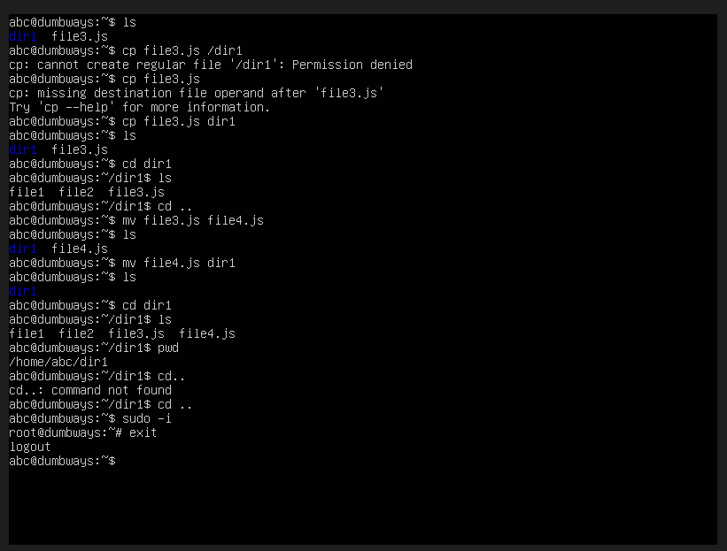

Topologi Jaringan
***

  

Diagram Jaringan

Empat PC terhubung ke satu switch dalam satu subnet 192.168.11.0/28.

Pembagian IP:
PC1 : 192.168.11.5
PC2 : 192.168.11.6
PC3 : 192.168.11.7
PC4 : 192.168.11.8
Catatan
Subnet /28 memiliki host usable 1–14.

Perbedaan SH(shell) dan BASH(Bourne-again Shell)
***
Shell itu merupakan program interface, di mana user bisa menginput command dan menjalakannya ke operating system.

BASH(Bourne Again Shell) itu merupakan salah satu dari jenis shell dan merupakan jenis shell yang paling umum.

Kalo disimpulkan BASH itu seperti Chrome merupakan salah satu dari browser.

Command basic BASH
***

1. ls
   
  

   Fungsi : Untuk Melihat File yang ada

2. cat (nama file)
   
  

   Fungsi : Untuk melihat Isi File yang dipilih

3. ls -nt
   
  

   Fungsi : Untuk melihat file, directory dan permissionnya

4. nano (nama file)
   
  

   

   Fungsi : Masuk ke dalam text editor

5. mkdir (nama directory)
   
  

   Fungsi : membuat directory baru

6. rm (nama file)
   
  

  Fungsi : Menghapus file yang dipilih

7. rm -r (nama directory)
   
  

   Fungsi : Menghapus directory dengan isinya

8. pwd
   
  

   Fungsi : melihat posisi user

9. cd (nama directory)
   
  

   Fungsi : Masuk ke dalam folder

10. cd ..
    
  

    Fungsi : Mundur satu step/atau keluar dari directory

11. sudo apt update
    
  

    Funsgi : Melihat Update software

12. cp (nama file) (tujuan directory)
    
  

    Fungsi : Copy file ke tujuan

13. mv (nama file) (nama baru file)
    
  

    Fungsi : Rename File

14. mv (nama file) (tujuan directory)
    
  

    Fungsi : memindahkan file(cut)

15. sudo -i
    
  

    Fungsi : Masuk ke mode root

16. exit (jika di dalam mode root)
    
  

    Funsgi : keluar dari mode root
