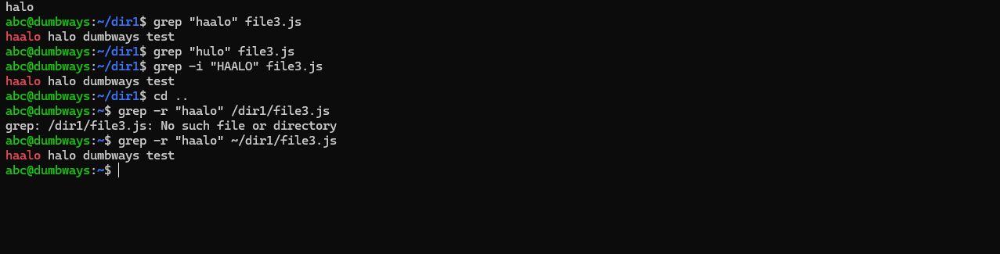
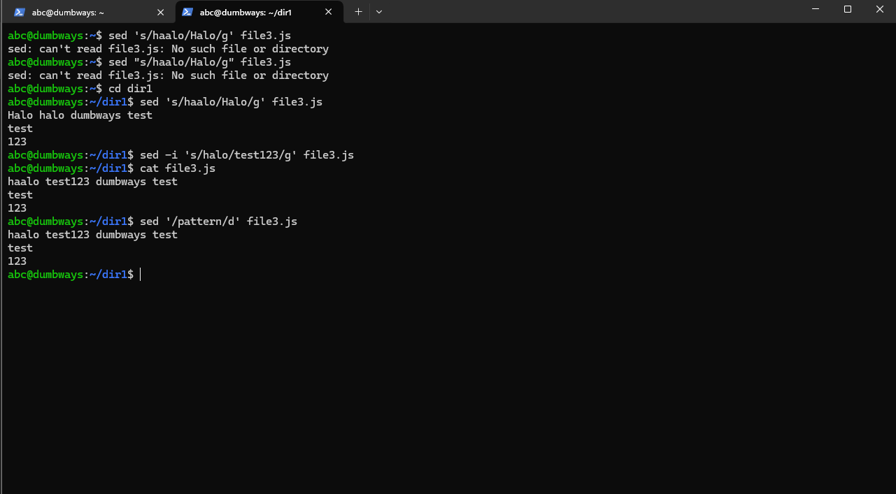
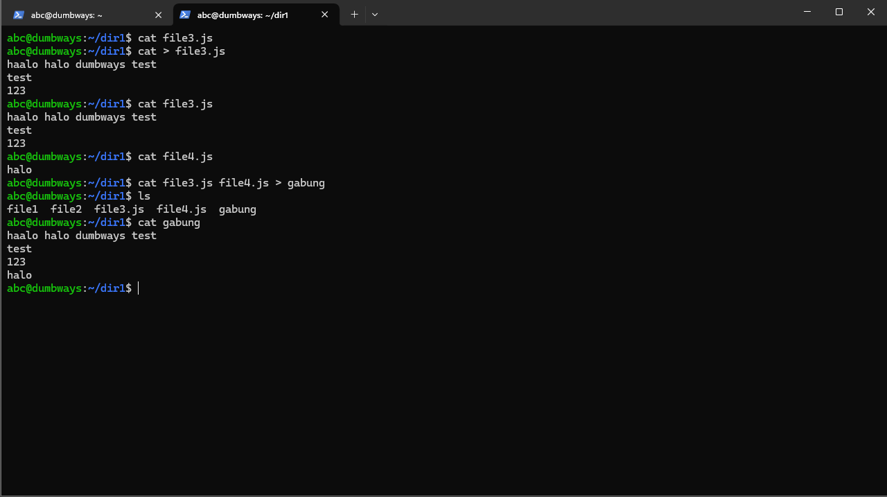
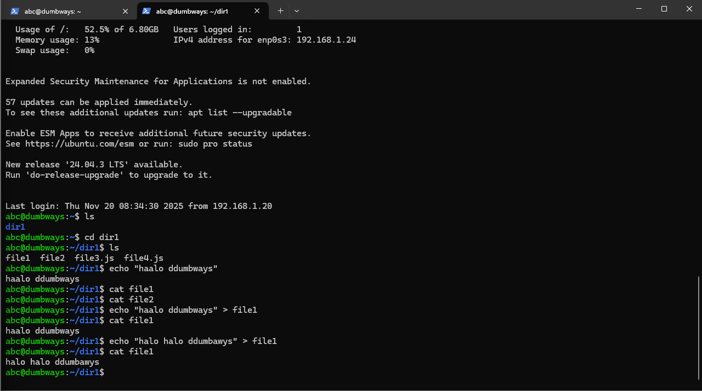
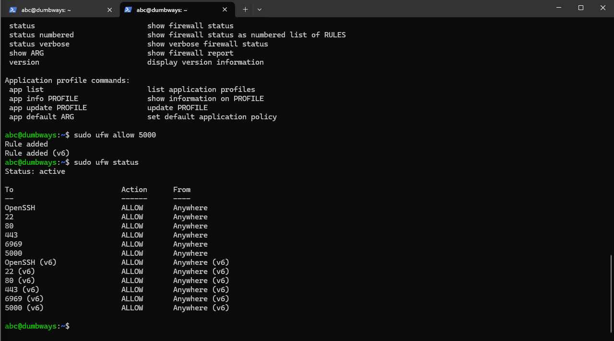

Step by step penggunaan text manipulation
***

1. Grep
   
  

   Fungsi : Mencari teks di dalam file
   pada fungsi gerp "hello" (nama file) dia akan mencari baris berisi kata yang diinput
   pada fungsi gerp -i commandi ini akan mencari kata yang sama dengan mengabaikan case sensitive

2. Sed
   
  

   Fungsi : manipulasi teks(replace,insert,delete)

3. Cat
   
  

   Fungsi : membaca file
   command cat (nama file) bisa digunakan untuk membaca file
   command cat > (nama file) menambahkan teks kedalam file
   command cat (nama file) (nama file) > (nama file) menggabung isi text dalam file dan membuat file baru

4.Echo
  
  

  Fungsi : mencetak text ke dalam terminal atau file
  echo "..." akan menampilkan text
  echo "..." > (nama file) akan mngisi atau overwrite text ke dalam file yang dituju
  echo "..." >> (nama file) akan menambahkan text ke dalam file

***
Set akses pada port 22 untuk ssh
Set akses pada port 80 untuk http
Set akses pada port 443 untuk https
Set akses pada port 3000
Set akses pada port 5000
Set akses pada port 6969
 
  

  
