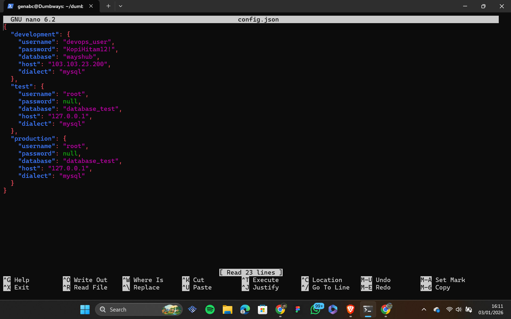
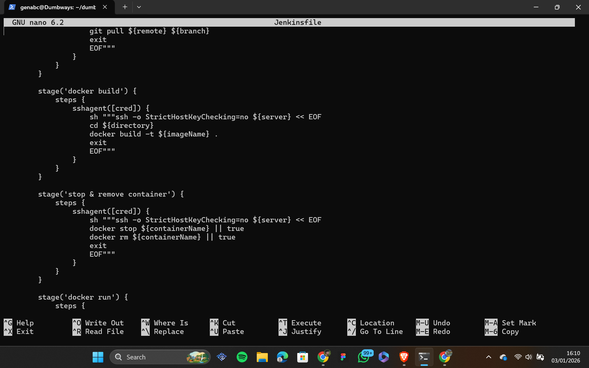
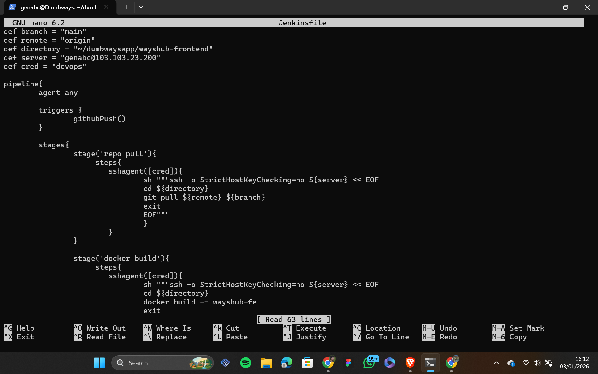
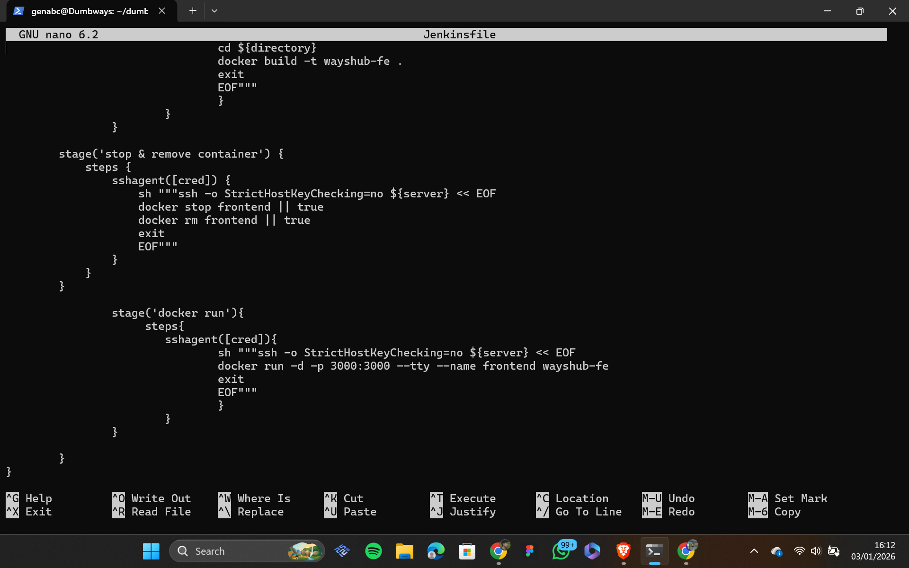
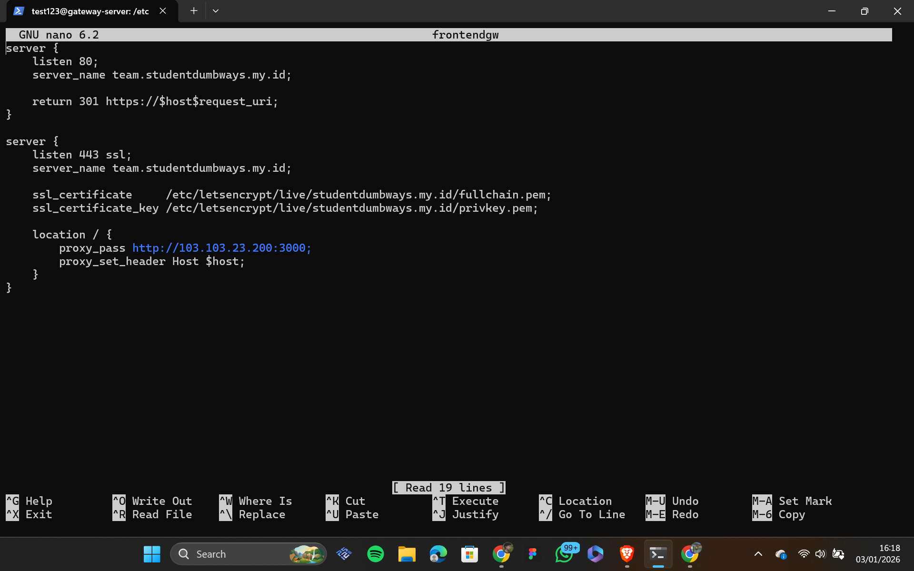
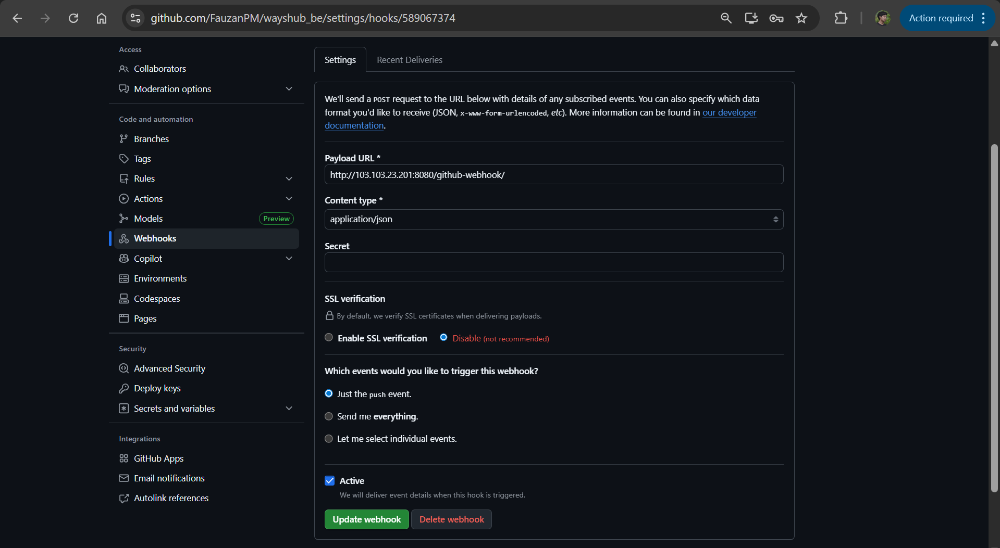
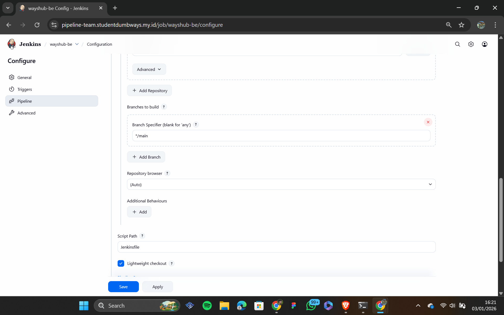
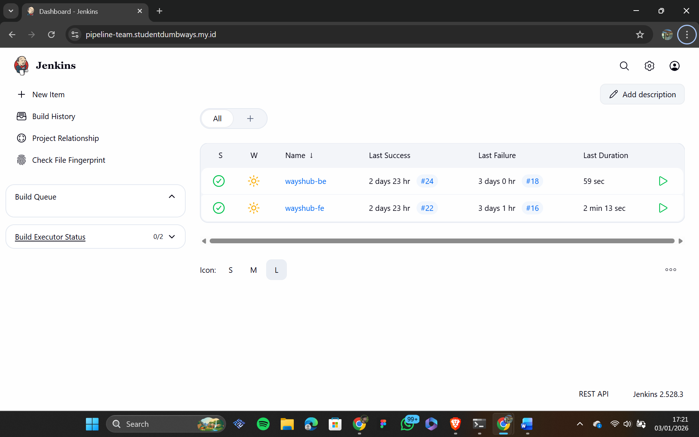

# Day 2 CI/CD Jenkins

## 1 install Jenkins dan Docker 

1

in the first stage we deploy jenkins on a dedicated server because jenkins requires significant system resources to run smoothly. the installation process involves setting up the java environment, configuring repository keyrings, and adding the official jenkins repository to the system.

to begin the setup we need to install fontconfig and openjdk-17-jre as the required dependencies for the automation server using sudo apt update and sudo apt install commands. once the environment is ready we download the official jenkins gpg key using wget to ensure the authenticity of the packages. after that we add the jenkins repository to the system sources list by executing the echo command and piping it to sudo tee. finally we run sudo apt update and sudo apt install jenkins followed by sudo systemctl start jenkins to initiate the service. once the service is active jenkins can be accessed through the browser using the server ip address and the default port.

2

in the second stage we focus on deploying docker engine on the application server to enable containerized workloads. to process this step we must do installation by following this steps: 
- sudo apt-get update update package index
- sudo apt-get install ca-certificates curl gnupg install dependency
- sudo install -m 0755 -d /etc/apt/keyrings curl -fsSL https://download.docker.com/linux/ubuntu/gpg | sudo gpg --dearmor -o /etc/apt/keyrings/docker.gpg add  gpg key
- echo "deb [arch=$(dpkg --print-architecture) signed-by=/etc/apt/keyrings/docker.gpg] https://download.docker.com/linux/ubuntu $(. /etc/os-release && echo "$VERSION_CODENAME") stable" | sudo tee /etc/apt/sources.list.d/docker.list > /dev/null
- sudo apt-get update, sudo apt-get install docker-ce docker-ce-cli containerd.io docker-buildx-plugin docker-compose-plugin install docker

to ensure the authenticity of the software we create a directory for repository keyrings and download the official docker gpg key using curl then process it with the gpg dearmor command for system compatibility. after the key is successfully integrated we add the official docker repository to the apt sources list by detecting the specific system architecture and distribution codename. finally after performing another package update we install the full docker suite including docker-ce docker-ce-cli containerd.io and essential plugins like docker-buildx and docker-compose to provide a complete container management environment.

## 2 Setup docker files

1

  
  

we implement containerization by creating specific DOCKERFILES for both the backend and frontend services within their respective directories. the backend DOCKERFILE is configured to manage the server side logic and environment variables needed for the application to function. for the frontend service we include the installation of sequelize-cli to facilitate database migrations and seeders directly from within the container environment. this approach ensures that all database schema changes and management tasks can be executed consistently across different environments without requiring manual setup on the host machine. by isolating these services into containers we achieve a more portable and scalable architecture for the entire application stack.

2

  

configuring the database connection by modifying the config.json file located within the backend directory. we must ensure that the username password and database name are correctly aligned with the credentials of the installed database system. additionally it is crucial to verify that the host parameter points to the correct ip address where the database service is running to ensure seamless communication between the backend application and the data layer. this configuration is vital for establishing a stable connection and allowing the application to perform essential data operations across the network.

3

  

create a docker-compose file in the root directory to orchestrate the backend frontend and database services. the configuration defines each service to run on top of docker with the build context pointing to the specific location of each DOCKERFILE. we ensure the database credentials and database names are synchronized between the services for successful authentication. finally we verify that all services are accessible and confirm that the backend is properly connected to the database.

## 3 setup jenkins file

1

  
  
  

we create a JENKINSFILE inside the backend directory to define the automation pipeline. within the pipeline stages we add a specific db migrate stage to handle database schema updates automatically during the deployment process. this ensures the database version stays consistent with the latest backend code changes.

2

  
  

create a JENKINSFILE within the frontend directory to manage the automation workflow for the frontend service. this file defines the necessary stages to build and deploy the user interface components consistently through the JENKINS CI/CD pipeline.

## 4 setup reverse proxy

1

configure custom domains for jenkins frontend and backend services using cloudflare as the DNS provider. this involves creating specific DNS records to point each subdomain to the server ip address ensuring all services are accessible through secure and easy to remember urls.

2

  
  
  

create a reverse proxy configuration to manage traffic for jenkins backend and frontend services. we implement ssl for secure communication and add the proxy_set_header X-Forwarded-Proto https directive within the location block to ensure the application correctly identifies the secure protocol during request forwarding.

## 5 config jenkins

1

  
  

after completing the initial registration we install all necessary plugins to support the pipeline workflow. we then navigate to the backend configuration and enable the github hook trigger option. to automate the build process we retrieve the webhook url from the github repository settings and integrate it with jenkins to enable automatic execution on every code push.

2

  
  

we add the github repository url to the jenkins project configuration to establish the connection between the source code and the automation server. after the setup is complete we perform several code changes and commits to trigger the pipeline and verify that the workflow runs correctly until the jenkins dashboard displays a successful build status for all stages.

  

