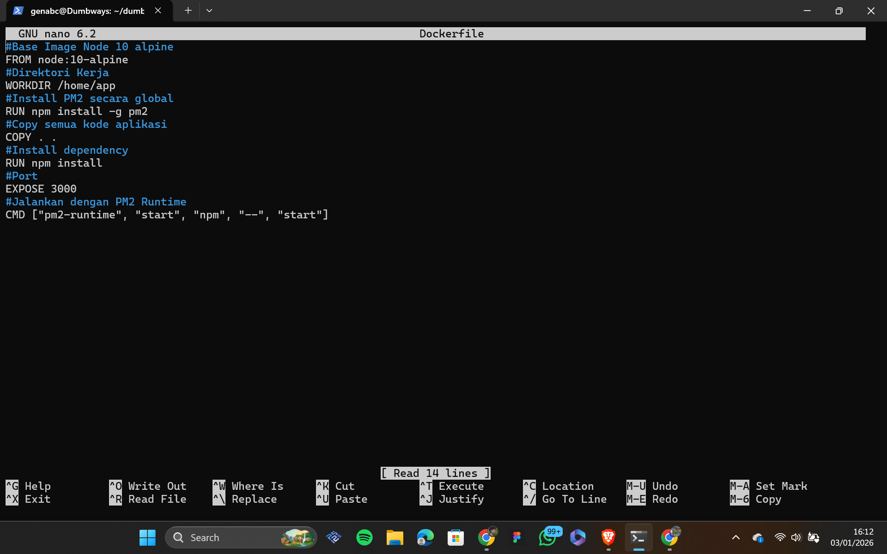

## Day 2 CI/CD Jenkins

##1 Set up Docker, dan Jenkins 

Langkah 1

  

Pada tahap pertama kita akan menginstall jenkins pada server yang terpisah dikarenakan jenkins berat.
untuk menginstall jenkins diperlukan menginstall java, menambahkan key rings repo, menambhakan repository jenkins dengan command seperti berikut.
sudo apt update, sudo apt install fontconfig, openjdk-17-jre untuk menginstall java(open jdk17)
sudo apt update, sudo apt install jenkins untuk menginstall jenkins
sudo wget -O (location key rings repo) https://pkg.jenkins.io/debian-stable/jenkins.io-2023.key untuk menambahkan keyrings
echo "deb [signed-by=/usr/share/keyrings/jenkins-keyring.asc] https://pkg.jenkins.io/debian-stable binary/" | sudo tee /etc/apt/sources.list.d/jenkins.list > /dev/null untuk menambahkan repository jenkins
dan jalankan sudo systemctl start jenkins untuk menjalankan jenkins

Langkah 2

pada tahap kedua kita akan menginstall docker di app server denga command seperti berikut.
sudo apt-get update untuk update package index
sudo apt-get install ca-certificates curl gnupg untuk install dependesi awal
sudo install -m 0755 -d /etc/apt/keyrings curl -fsSL https://download.docker.com/linux/ubuntu/gpg | sudo gpg --dearmor -o /etc/apt/keyrings/docker.gpg untuk menambahkan gpg key
echo "deb [arch=$(dpkg --print-architecture) signed-by=/etc/apt/keyrings/docker.gpg] https://download.docker.com/linux/ubuntu $(. /etc/os-release && echo "$VERSION_CODENAME") stable" | sudo tee /etc/apt/sources.list.d/docker.list > /dev/null
sudo apt-get update, sudo apt-get install docker-ce docker-ce-cli containerd.io docker-buildx-plugin docker-compose-plugin untuk install docker

##2 Setup docker files pada frontend dan backend

  
  

Langkah 4

Langkah 5

Langkah 6

Langkah 7

Langkah 8

