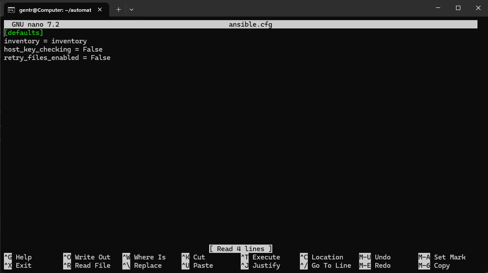
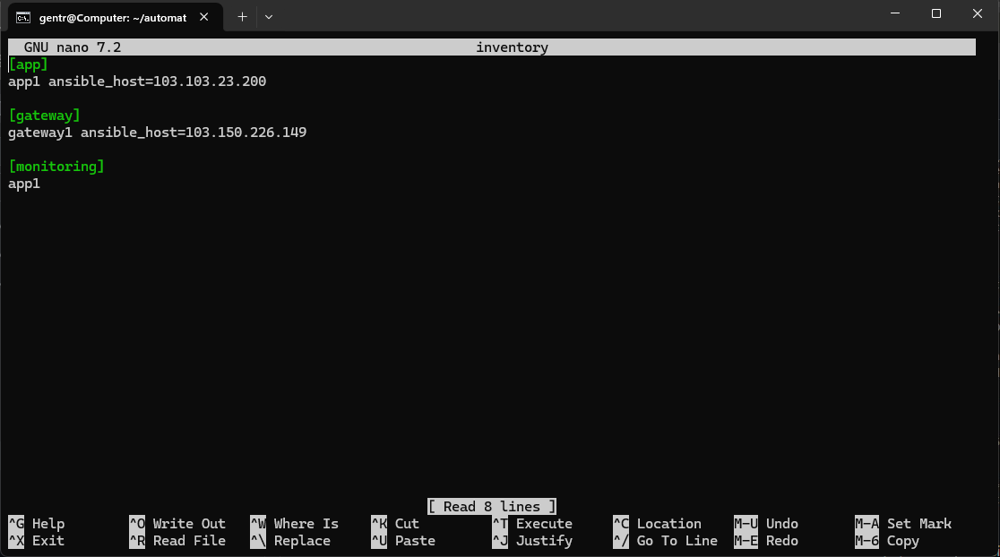
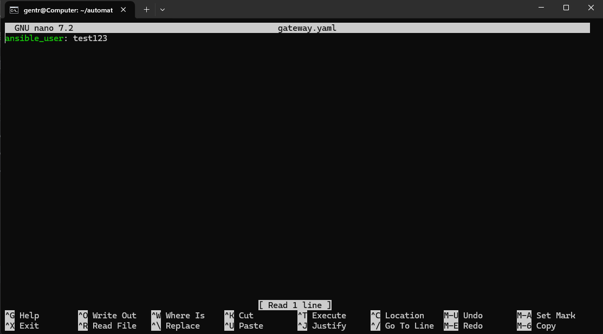
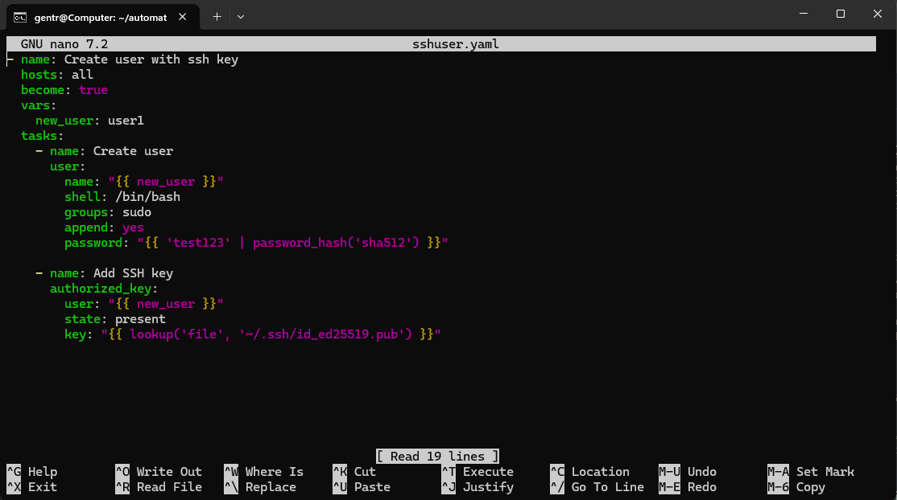
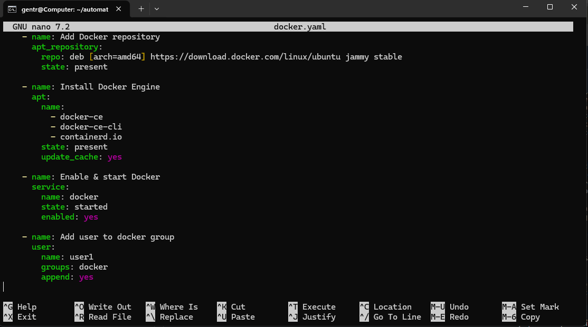
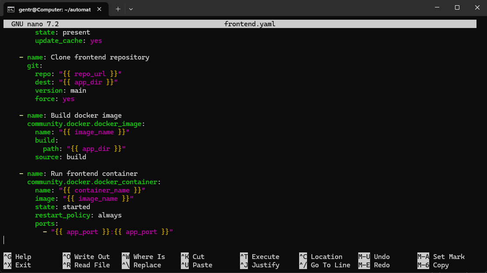

# Ansible

## 1 install WSL, dan setup

### Langkah 1

  

Untuk mengerjakan tugas ansible saya menggunakan wsl untuk melakukan setup ansible playbook dan menjalankan ansible. intsall WSL di pc kalian dengan command wsl --install lalu wsl.exe --install --no-distribution. kemudian jika sudah terinstall kita akan menginstall distro ubuntu dengan menjalankan wsl --install -d ubuntu-22.04(masukan versi yang tersedia).

  
  

lalu tunggu proses instalasi distro selsai, dan setelah selesai kita bisa menjalankan wsl dengan command wsl di terminal.

### Langkah 2

lalu kita akan menambahkan modul venv agar ansible terisolasi(tidak mengganggu sistem). masuk kedalam home di wsl lalu jalankan sudo apt update dan sudo install python3-venv -y. jika proses instalasi sudah selesai kita akan lanjut membuat folder project untuk menjalankan ansible mkdir (nama dir), masuk kedalam directory dan jalankan python3 -m venv ansible-env. untuk masuk kedalam venv kita bisa menggunakan command ini source ansible-env/bin/activate dan untuk keluar dari venv kita bisa deactivate. ansible hanya bisa dijalankan di dalam venv.

  

## 2 set up ansible

### langkah 1 

kita akan membuat file ansible.cfg, invetory, dan directory group_vars yang berisi file app.yaml dan gateway.yaml.

  

file ansible.cfg akan memberitahu secara otomatis untuk menggunakan file yang bernama inventory sebagai daftar host target.

  

pada file ini akan mendefinisikan target host untuk menjalankan playbook, di mana di bagi menjadi 3 yaitu app, gateway, dan monitoring. di sini saya hanya menggunakan 2 server jadi monitoring target ke app server.

  
  

dir group_vars berfungsi untuk mencocokan nama file di dalam folder ini dengan nama group di inventory, untuk menentukan variable mana yang akan digunakan.

### langkah 2

  

setelah selsai dengan setup kita akan melakukan test membuat playbook. playbook yang pertama berfungsi untuk pembuat user baru pada server yang kit target, dan kita akan memberikan akses ssh public key dari wsl lalu di salin ke dalam authorized_key milik user1 di server target.

## install docker

### langkah 1

  
  

selanjutnya kita akan install docker. pada environment ini semua aplikasi akan running di atas docker. add docker repo untuk menambahkan repo resmi docker ke dalam sistem ubuntu menggunakan codename jammy. install docker engine menginstall paket docker (docker-ce, cli, containerd), enable & start docker untuk mengaktifkan service docker agar langsung running dadn otomatis nyala walaupun server direboot. add user to docker group memasukan user1 ke docker.

### langkah 2

kita akan coba menjalankan frontend di atas docker

  
  

ansible akan menggunakan module git untuk clone rerpo dari githuhb ke folder tujuan yaitu app_dir. pada parameter force: yes ini agar memastikan jika ada perubahan lokal yang konflik, code dari remote tetap diutamakan. build docker image menggunakan modul community.docker.docker_image untuk melakukan proses build berdasarkan dockerfile, hasilnya di tulis dalam variable image_name.
