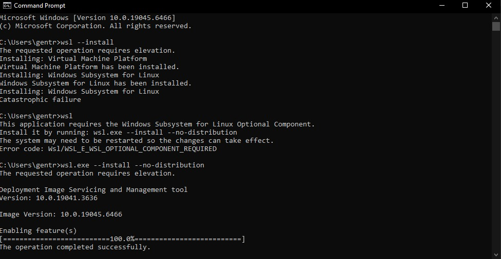
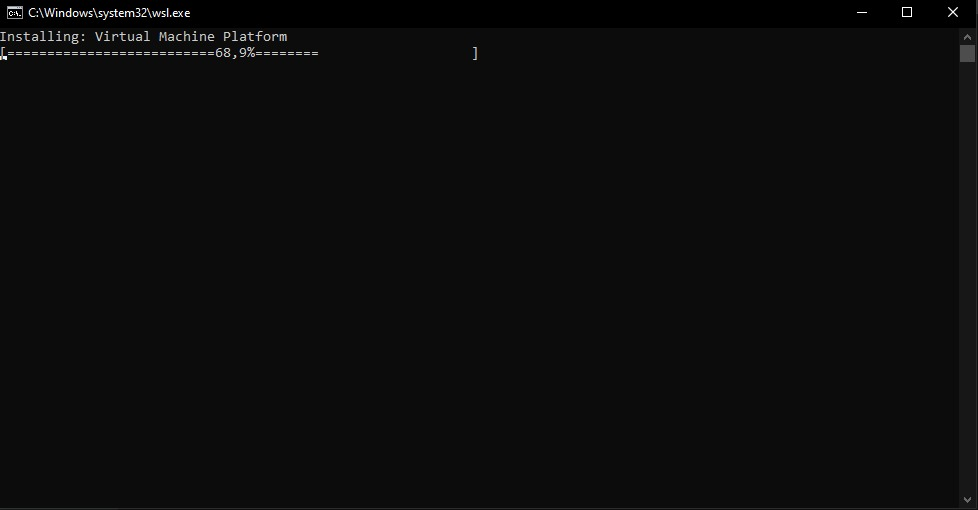
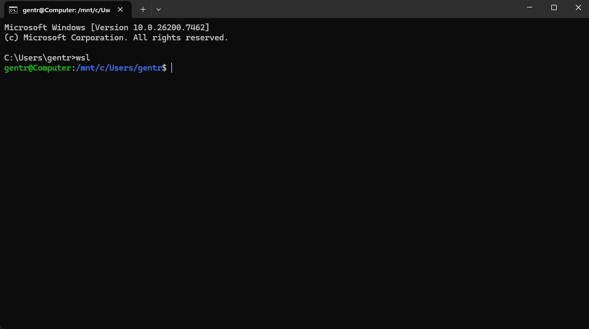
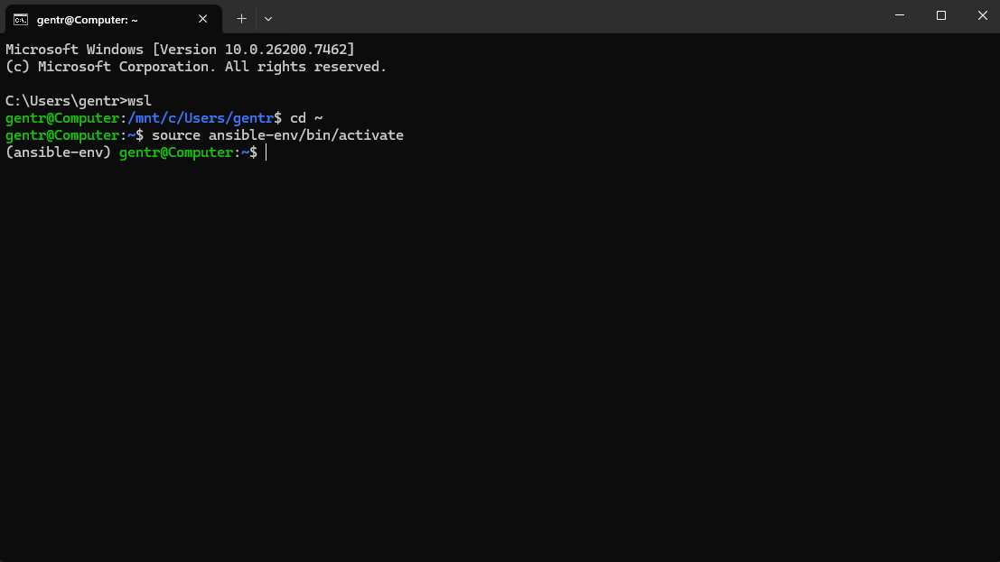

# Ansible

## 1 install WSL, dan setup

### Langkah 1

  

Untuk mengerjakan tugas ansible saya menggunakan wsl untuk melakukan setup ansible playbook dan menjalankan ansible. intsall WSL di pc kalian dengan command wsl --install lalu wsl.exe --install --no-distribution. kemudian jika sudah terinstall kita akan menginstall distro ubuntu dengan menjalankan wsl --install -d ubuntu-22.04(masukan versi yang tersedia).

  
  

lalu tunggu proses instalasi distro selsai, dan setelah selesai kita bisa menjalankan wsl dengan command wsl di terminal.

### Langkah 2

lalu kita akan menambahkan modul venv agar ansible terisolasi(tidak mengganggu sistem). masuk kedalam home di wsl lalu jalankan sudo apt update dan sudo install python3-venv -y. jika proses instalasi sudah selesai kita akan lanjut membuat folder project untuk menjalankan ansible mkdir (nama dir), masuk kedalam directory dan jalankan python3 -m venv ansible-env. untuk masuk kedalam venv kita bisa menggunakan command ini source ansible-env/bin/activate dan untuk keluar dari venv kita bisa deactivate. ansible hanya bisa dijalankan di dalam venv.

  

## 2 set up ansible

### langkah 1

